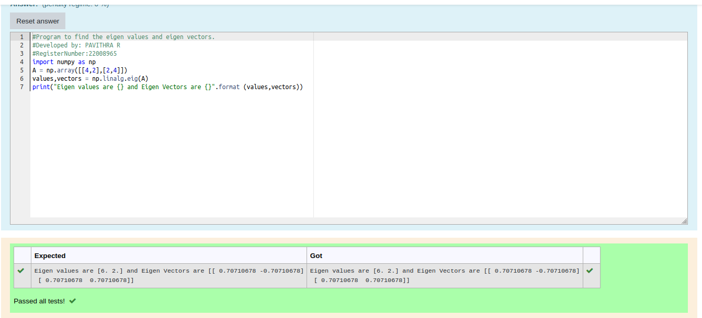

# EIGENVALUES-AND-EIGENVECTORS

## Aim:

To write a python program to find the Eigenvalues and Eigen Vectors

## Equipment’s required:

1. 	Hardware – PCs
2. 	Anaconda – Python 3.7 Installation / Moodle-Code Runner

## Algorithm:


### Step1 :
Import numpy package

### Step 2:
Get the input matrix

### Step 3:
Using the np.linalg.eig(),  we get two results (first is eigenvalue and second is eigenvector) of the given matrix.

### Step 4:
End the program

## Program:
```python
#Program to find the eigen values and eigen vectors.
#Developed by: PAVITHRA R
#RegisterNumber:22008965
import numpy as np
A = np.array([[4,2],[2,4]])
values,vectors = np.linalg.eig(A)
print("Eigen values are {} and Eigen Vectors are {}".format (values,vectors))
```

## Output:


## Result:
Thus the Eigenvalue and Eigenvector is successfully solved using python program
